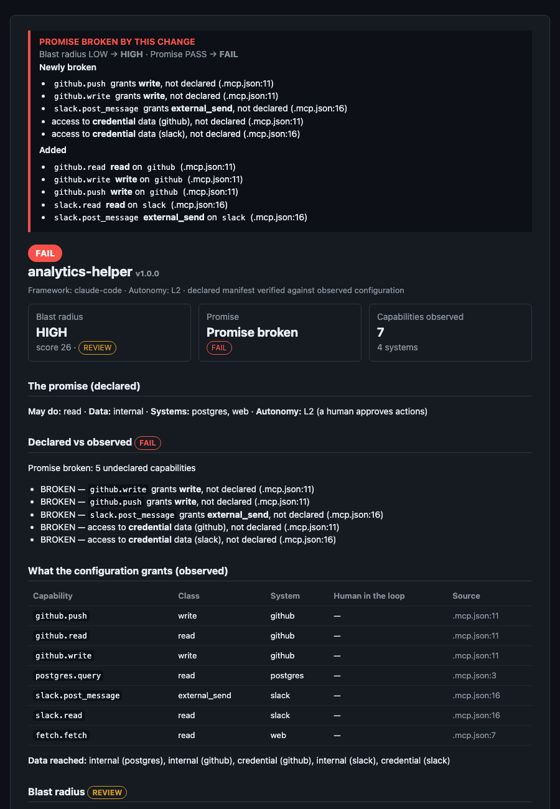

# Integrations

## Install

```bash
pipx install agent-assurance              # from PyPI
pipx install "agent-assurance[mcp]"       # with the MCP server
pipx install git+https://github.com/kunko-ai-labs/agent-assurance@v0.5.2   # or pinned to a release tag
```

Releases ship a wheel and an sdist with Sigstore build provenance (`gh attestation verify agent_assurance-*.whl -R kunko-ai-labs/agent-assurance`).

Every way to run Agent Assurance: CLI, GitHub Action, pre-commit, MCP server, Claude Code hook, Python library, and the evidence (attestation) flow.

## CLI

```bash
agent-assurance scan .                                   # observe + verify (picks up ./agent-assurance.yaml)
agent-assurance scan path/to/repo -m promise.yaml --format sarif -o aa.sarif
agent-assurance diff base-checkout head-checkout --fail-on-delta   # what did this change do?
agent-assurance attest . -o aa-attestation.json          # evidence: what the config granted at this commit
agent-assurance check all agent-assurance.yaml           # the promise alone: how much could it break?
agent-assurance validate agent-assurance.yaml            # schema-check (manifest or policy, detected by apiVersion)
agent-assurance validate --policy agent-assurance.policy.yaml   # policy: name, sha256, what it overrides
```

Formats: `md` (PR comment / job summary), `json` (pipelines), `sarif` (GitHub code scanning; PASS is `kind: pass` so a clean agent never creates an alert; `diff` adds `baselineState`), `html` (the **capability card**).

## Capability card

`--format html` writes a single self-contained file — no scripts, no external assets — that reads like a nutrition label: verdict, the promise, what was observed with file:line and whether a human is in the loop, the score breakdown, sources scanned, policy and tool version. Same facts as the JSON. Send it to an auditor, a customer, or your manager; in the Action, `card: aa-card.html` uploads it as an artifact. It also prints cleanly: on paper or saved to PDF the page is white, the verdict colours stay legible, cards and table rows do not split across pages, and the footer keeps the tool version.



**Exit codes are a contract:** `0` pass (REVIEW too, unless `--fail-on review`) · `1` gate tripped · `2` usage/manifest error. Tested in `tests/test_cli_contract.py` and exercised with the installed binary in CI.

Try the bundled repos under `examples/repos/`: `mcp-promise-kept` (PASS), `mcp-promise-broken` (FAIL), `mcp-unknown-server` (REVIEW), `claude-code-approval-kept` (PASS), `claude-code-approval-broken` (FAIL: `allow: Bash(*)` under a declared L2).

## GitHub Action

```yaml
permissions:
  contents: read
  pull-requests: write     # only for the diff comment
  security-events: write   # only if upload-sarif: true

steps:
  - uses: actions/checkout@v4
  - uses: kunko-ai-labs/agent-assurance@v0.5   # or pin the release's commit SHA (README: "Running third-party code in your CI")
    with:
      mode: diff             # on pull_request: what did this change do? (comment + gate)
      # mode: scan           # on push: observe + verify, SARIF to the Security tab
      manifest: agent-assurance.yaml
      fail-on: fail          # or: review
      fail-on-delta: "true"  # diff: also fail when reach grows or the promise breaks
      sarif: aa.sarif        # optional
      upload-sarif: "true"   # optional
      card: aa-card.html     # optional: capability card artifact
      attest: write          # optional: in-toto evidence ('sign' = Sigstore, needs id-token/attestations: write)
      policy: agent-assurance.policy.yaml   # optional
```

The markdown report lands in the job summary; in `diff` mode one PR comment is created and then updated on every push. This repo's own [`assurance.yml`](../.github/workflows/assurance.yml) asserts that the Action passes what it should and blocks what it should — a green run means the gate still works.

## pre-commit

```yaml
- repo: https://github.com/kunko-ai-labs/agent-assurance
  rev: v0.3.0
  hooks:
    - id: agent-assurance-scan
```

## Inside the agent's own session

```bash
pip install "agent-assurance[mcp]"
claude mcp add agent-assurance -- agent-assurance-mcp
```

Tools `scan`, `check` and `would_break`: the agent can ask *"if I add this MCP server, does the promise break?"* before touching a file. Or install the [PostToolUse hook](../contrib/claude-code/) and the agent is told the moment an edit breaks the promise. Details in [`contrib/claude-code/`](../contrib/claude-code/).

## As a library

```python
from agent_assurance import engine
from agent_assurance.checks.base import Context
from agent_assurance.manifest import Manifest
from agent_assurance.scan import scan_directory

declared = Manifest.from_file("agent-assurance.yaml")
result = scan_directory(".", declared)
report = engine.run(result.observed, ctx=Context(declared=declared, observed=result.observed), sources=result.sources)
print(report.verdict, [(r.check_id, r.status.value) for r in report.results])
```

Add a source: subclass `scan.base.Scanner` (`detect()` + `parse()` returning tools with `source="path:line"`), register it in `scan.SCANNERS`, add a fixture under `examples/repos/` and a job in `assurance.yml`. Add a server: one `CatalogEntry` with its source. Add a check: subclass `checks.base.Check`, register in `checks.ALL_CHECKS`.

## Evidence that survives the repo

```bash
agent-assurance attest . -o aa-attestation.json
```

Writes an [in-toto Statement v1](https://in-toto.io/Statement/v1): the manifest and every parsed config file as subjects (sha256), and as predicate the tool version, timestamp, git commit, the declared promise, the observed capabilities, the full report and the standards touched. Archive it with the release, or let the Action sign it:

```yaml
permissions:
  id-token: write
  attestations: write
steps:
  - uses: kunko-ai-labs/agent-assurance@v0.5   # or pin the release's commit SHA (README: "Running third-party code in your CI")
    with:
      mode: scan
      attest: sign          # 'write' = unsigned JSON artifact only
```

Then anyone can check, later, what your agent was allowed to do at a given commit and whether it matched the promise:

```bash
gh attestation verify .mcp.json -R your-org/your-repo \
  --predicate-type https://github.com/kunko-ai-labs/agent-assurance/attestation/v1
```

This is the record-keeping shape EU AI Act art. 12 (reconstructability) and SOC 2 change-management reviews ask for, for the *capabilities* of an agent; the mapping is `adapted`, not a conformance claim. Runtime logs remain the other half. Sigstore signing needs a public repository or GitHub Enterprise; the unsigned JSON works everywhere.
